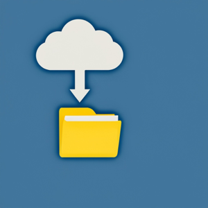

# Google Drive Export

<div style="float: right; margin: 0 10px 0 10px;">
    
</div>

This tool allows you to export Google Docs, Sheets, and Slides to Microsoft Office formats (Docx, Xlsx, Pptx) and PDFs from a specific Google Drive directory or from Shared/Team Drives. 

Why is this tool even necessary, you might wonder? Doesn't Google Drive for Desktop already handle this task? Well, it's a bit more complicated than that. Google Drive for Desktop, along with various other Google Drive mounting solutions like Cloud Mounter, indeed grants you access to your Google Drive files. You can access a wide range of files, including PDFs, images, and other formats, even Google Docs files like Docs, Sheets, and Slides. You can copy them and back them up to your preferred backup solution.

However, here's the catch: those Google Docs, Sheets, and Slides files aren't actually your raw data. Instead, they're small text files that function as links to the real files stored in your Google Drive. So, if you want to export the actual files, you've got to do it manually! If you only have a few files, no big deal. But imagine having hundreds or thousands of files scattered across numerous directories. That's where this tool comes in handy – it automates the process of exporting all those Google Docs, Sheets, and Slides into native Office formats.

I'm a big fan of Google Docs, Sheets, and Slides myself, but I also value having my data securely backed up just in case Google or some other unforeseen issue comes into play!

This tool will recurse into Google Drive subdirectories from the starting directory ID that you specify and create a matching directory structure in the output directory. The tool will then only export Google Docs, Sheets and Slides to their corresponding Office format as well as a PDF of each. Your output directory can be any path that your workstation has access to, including a network drive. The tool will check for existing files in the output directory and only export files that don't already exist or have been updated since the last export.

A remote update to this tool defaults to a remote time of 60 seconds after the local file's update time. This default can be changed by using the `--update-tolerance` flag. See [Other Options](#other-options) below for more details.

The tool uses a Google Cloud Platform Service Account for authentication, ensuring secure access to your Google Drive files.

Note that if you edit the local copies of your exported files, they may be overwritten the next time you run the tool. If you want to edit the exported files, you should copy them to a different directory first!

This tool's author is not affiliated with Google. It is provided as-is with no warranty or guarantee. Use at your own risk.

> **Notes:** 
> - Due to the Google Drive's API limitations, any files larger than 10MB can't be exported with this tool.
> - Google Drive allows directory and file names containing "/" (forward slash). Since Unix, Linux and POSIX systems don't allow the "/" in names, that character is replaced with an "_" (underscore.)

## Prerequisites

Before using this tool, make sure you have the following prerequisites:

1. **Docker**: The recommended method for running this tool is with Docker. You can download Docker Desktop or Docker CE from [docker.com](https://www.docker.com/).
   
   **Node.js**: Alternatively, you can install Node.js on your machine. You can download it from [nodejs.org](https://nodejs.org/). This tool was tested with Node.js v18.
2. **Google Cloud Project**: You will need a Google Cloud project with the Google Drive API enabled.
3. **Service Account**: Create a service account within your Google Cloud project and generate a JSON key file for authentication. You can find instructions for creating a service account and generating a key file in the [Google Cloud documentation](https://cloud.google.com/iam/docs/creating-managing-service-account-keys). Note that a service account has an email address associated with it, which you will need to grant access to your Google Drive files.
4. **Google Drive Directory**: Identify the specific Google Drive directory that you want to export files from and note its folder ID. Then grant your service account access to the directory by using the service account email. The service account only needs VIEW permission.

## Definitions

What is a Google Drive Folder Id?

Navigate to any Google Drive folder in your browser. Observe the URL which will look something like this:
```text
https://drive.google.com/drive/u/0/folders/9iT7va0dagP5KaGelXo8-HbxQeKcn9pwc?ths=true
```
_(Note, this is not a valid folder id. It's the correct structure, but the folder id is fake here being used as an example.)_

The Google Drive Folder Id is the part after `/folders/` and before `?`. In this example, the folder ID is `9iT7va0dagP5KaGelXo8-HbxQeKcn9pwc`. It uniquely identifies the folder in Google Drive. This is what we'll use to identify the starting directory for the tool.

## Setup for Docker (Recommended)

If using Docker, follow these steps to set up and use the tool:

1. Clone or download this repository to your local machine.
2. Save your service account JSON key file to the `./secrets` directory of the project and rename it to `serviceAccountKey.json`.
3. You will customize the default output directory and starting folder ID by specifying them as command-line arguments when running the tool.
   Example:
   ``` bash
   ./x-docker-run-google-drive-export.sh "./my_output_directory" "your_folder_id" "serviceAccountKey.json" silent
   ```
   (Note, you can omit the "silent" argument if you want to see the tool's output in the terminal.)

## Setup for NodeJS Native

If using NodeJS natively on your workstation, follow these steps to set up and use the tool:

1. Clone or download this repository to your local machine.
2. Ensure you have NodeJS v18 installed then install project dependencies by running the following on the root of this repository:
   ``` bash
   npm install
   ```
3. Save your service account JSON key file to the root directory of the project and rename it to `serviceAccountKey.json`.
4. You will customize the default output directory and starting folder ID by specifying them as command-line arguments when running the tool. Use the `-o` or `--output` flag to specify the output directory and the `-f` or `--folder` flag to specify the starting folder ID.
   Example:
   ``` bash
   node app.mjs --output "./my_output_directory" --folder "your_folder_id" --keyfile "serviceAccountKey.json" --silent
   ```
   (Note, you can omit the "--silent" argument if you want to see the tool's output in the terminal.)

## Other Options

You can also specify the following optional command-line arguments to change the tool's behavior:
- `--update-tolerance 60` - defined in seconds, the number you pass determines when the tool considers the remote google drive file updated. The default is 60 seconds meaning that if the Google Drive file is updated 60s or more after the local file update time, then it's considered updated and will be fetched and processed.
- `--team-drive` - if the root folder is a shared/team drive, you must specify this flag to enable shared drive support. Otherwise, the tool will run but will not actually export any files.

## Multiple Service Accounts

You can use multiple service accounts to export files from multiple Google Drive directories. To do this, you will need to save the key file for each account into the `./secrets` directory giving each a unique name. Then you specify the service account key file to use when running the tool using the `--keyfile` argument.

## Help and Troubleshooting

- If you make numerous directory changes in Google Drive, you may need to wait a few minutes (maybe hours) before the changes are reflected in the API. Otherwise, you may not accurately see the directory structure in the API and therefore won't export all the files. Luckily, this tool can be re-run as many times as needed to export all the files, and since it checks for existing files in the output directory, it won't re-export files that have already been exported unless they have been updated.
- This tool was tested on macOS and Linux. For use with native NodeJS on Windows, you'll possibly need to tweak the creation of folder paths to use Windows path separators. It's possible that file names also need to be tweaked/formatted for Windows. Alternatively, you can use Docker on Windows to run the tool with the above instructions for Docker.
- If you encounter issues or have questions about using the tool, you can run it with the `--help` flag to see usage information and examples:
  ```
  node app.mjs --help
  ```
- If you need assistance with Google Cloud setup or service accounts, refer to the Google Cloud documentation.

## License

This project is licensed under the MIT License - see the [LICENSE](LICENSE) file for details.

## References

* [Google Drive API, Implement shared drive support](https://developers.google.com/drive/api/guides/enable-shareddrives)
* [Google Drive API, files.list method](https://developers.google.com/drive/api/reference/rest/v3/files/list)

## Roadmap

Refer to [GitHub issues](https://github.com/ericwastaken/google-drive-export/issues) for planned enhancements and bug fixes.
